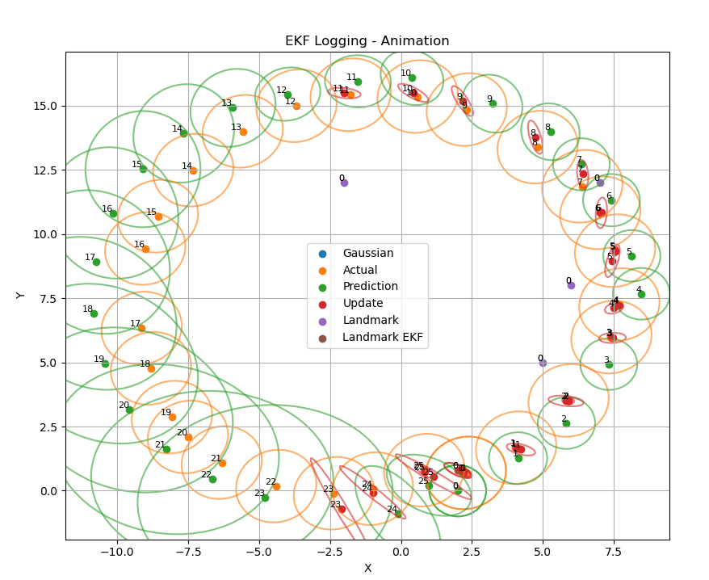

# EKF-SLAM Exercise

This project demonstrates an implementation of the Extended Kalman Filter (EKF) using modern C++.

## Requirements

- C++17 or later
- CMake 3.10+
- Eigen3

## Build Instructions

```bash
git clone https://github.com/moralkerim/EKF-Exercise.git
cd EKF-Exercise
mkdir build && cd build
cmake ..
make
```

## Usage
Run the code:
```bash
cd build
./ekf_main
```

Move log file next to plotter:
```bash
cp poses.txt ~/EKF-Exercise/plotter
python3 plotter.py
```
You should see random robot poses, EKF prediction and EKF update poses.



## Project Structure

- `src/` - Source code
- `include/` - Header files
- `examples/` - Example usage
- `tests/` - Unit tests

## References

- [Probabilistic Robotics by Thrun, Burgard, and Fox](https://probabilistic-robotics.org/)


## License

This project is licensed under the MIT License.